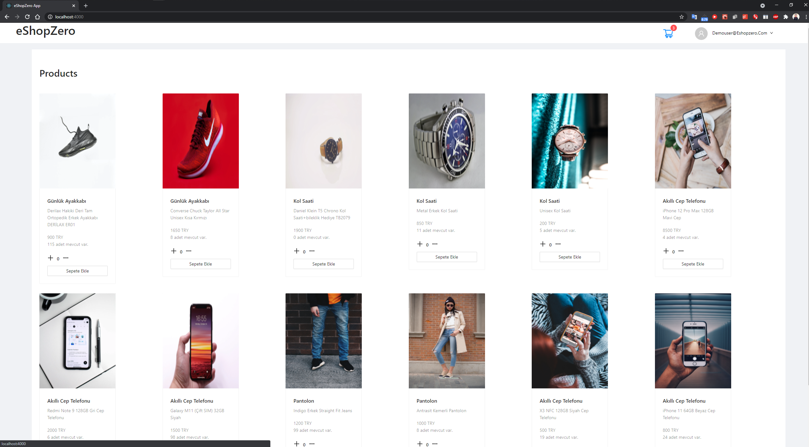
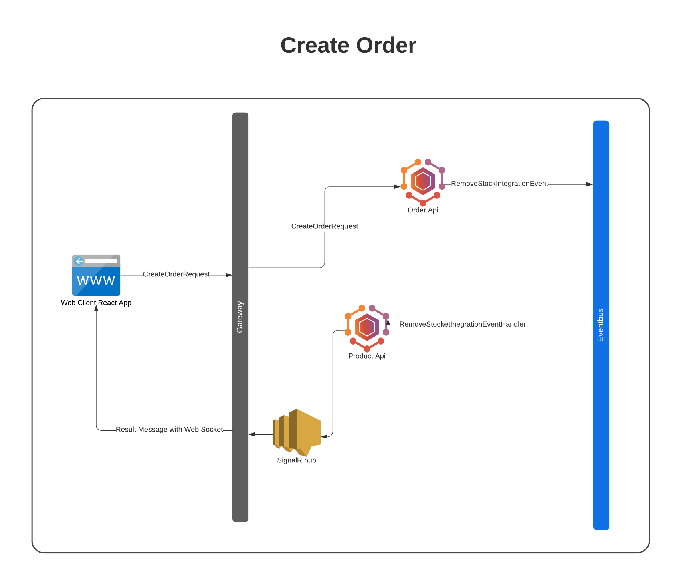
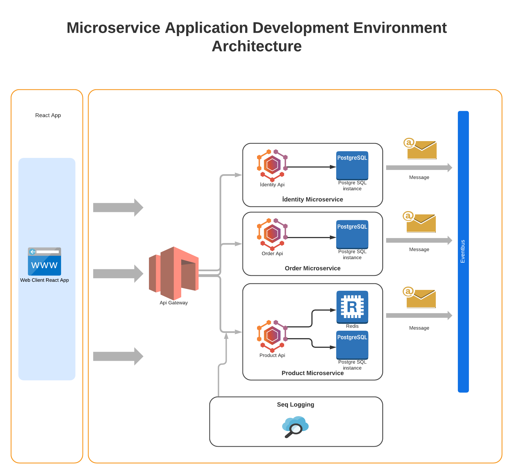
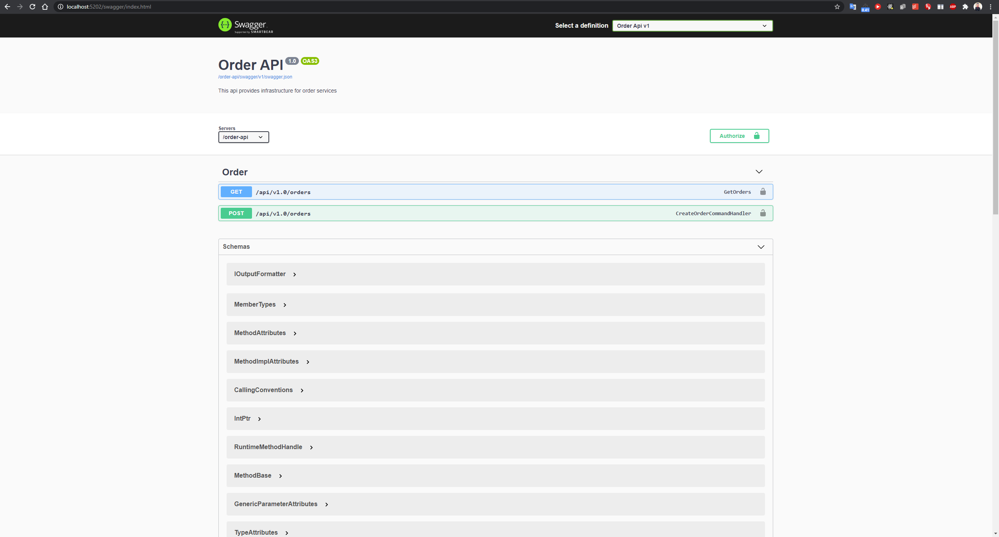
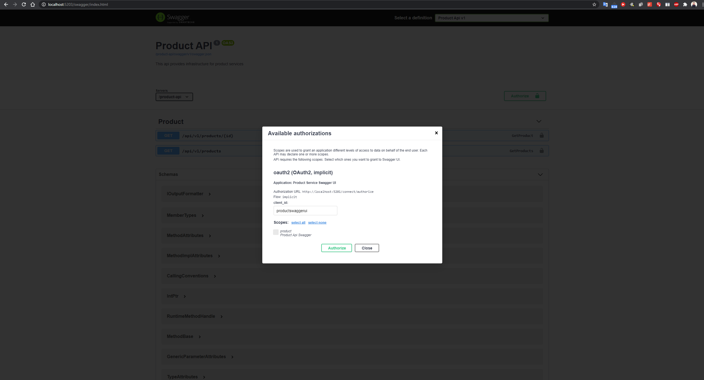
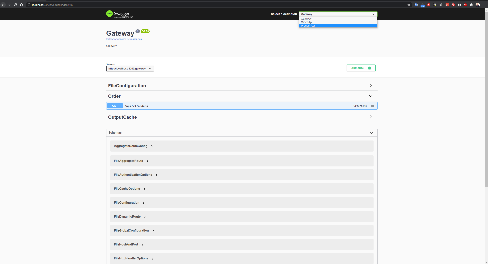
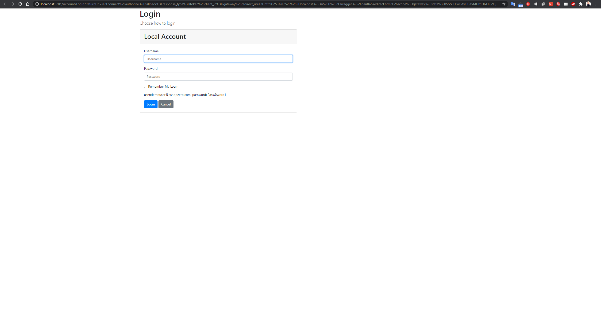
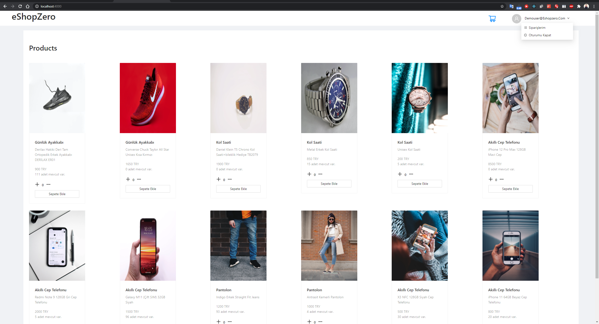
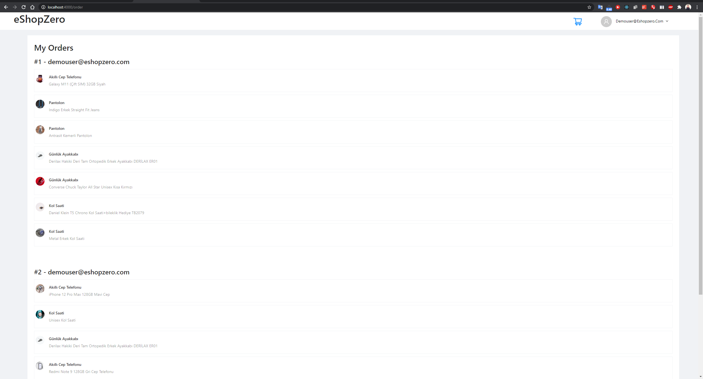
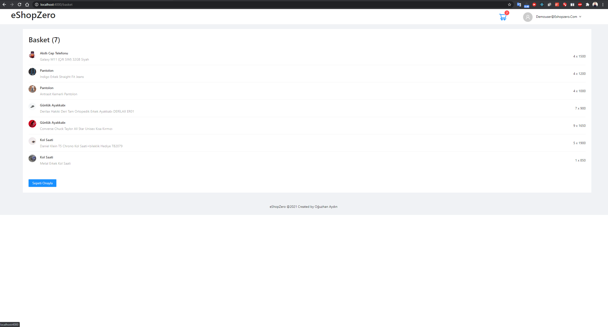

# .NET Microservices Sample Application

Sample .NET 5 reference application, based on a simplified microservices architecture and Docker containers.



## Getting Started

Make sure you have install and configured docker in your environment. After that, you can run the below commands from the **/** directory and get started with the `eShopZero` immediately.

```powershell
docker-compose up --build
```

You should be able to browse different components of the application by using the below URLs :

```
Web React : http://localhost:4000/
```
## Scenario

The user adds their products to the basket during shopping and creates an order. Order API broadcasts order creation message to RabbitMQ. Product Api consumes this event. The ordered product quantity reduces the current stock.

## Create Order Scenario



## Docker Containers

| Image   | Port  | Host   | 
|---|---|---|
|  eshopzero/client:latest  | 4000  | localhost  |
|  eshopzero/gateway:dev |  5200 | localhost  |
|  eshopzero/product-api:dev | 5203  | localhost  |
|  eshopzero/order-api:dev | 5202  | localhost  |
|  eshopzero/identity-api:dev | 5201  | localhost  |
|  rabbitmq:3-management-alpine | 15672  | localhost  |
|  datalust/seq:latest | 5340  | localhost  |
|  postgres:latest | 5432  | localhost  |
|  redis:alpine | 6379  | localhost  |

## Architecture Overview



## Tech Stack

- .Net 5
- RabbitMQ
- Serilog & Seq 
- Redis
- Event Source
- CQRS && DDD
- ReactJS
- İdentity Server
- Docker
- Ocelot
- PostgreSQL
- Entity Framework Core

# Screenshots



## Order Api


## Product Api



## Gateway



## Identity Server



## Client App

#### Home Page

<br/>
#### Basket Page

<br/>

#### Order Page


