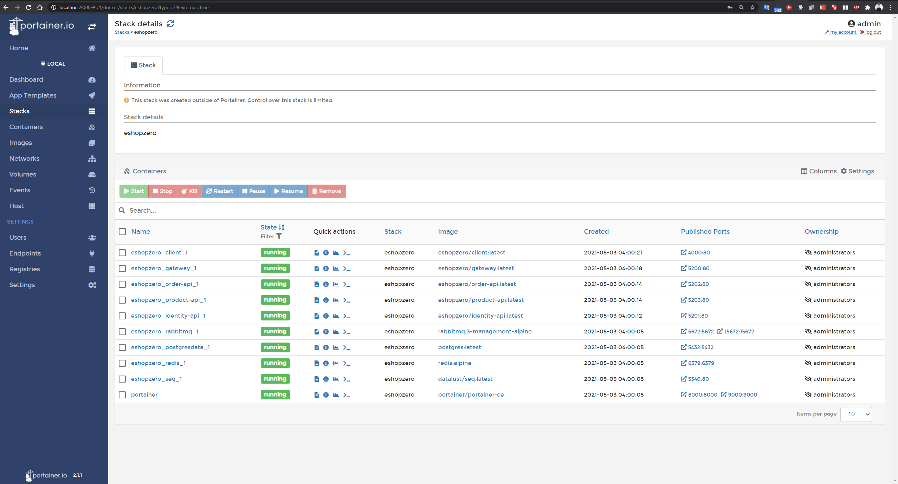
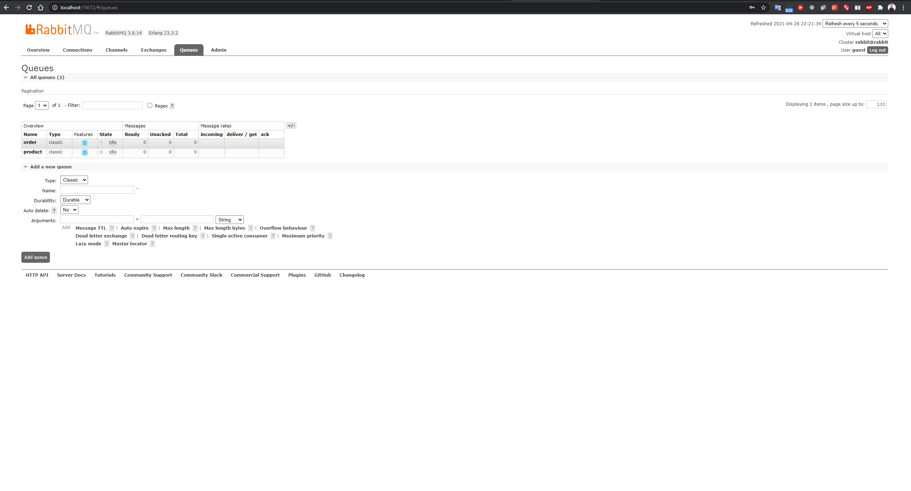
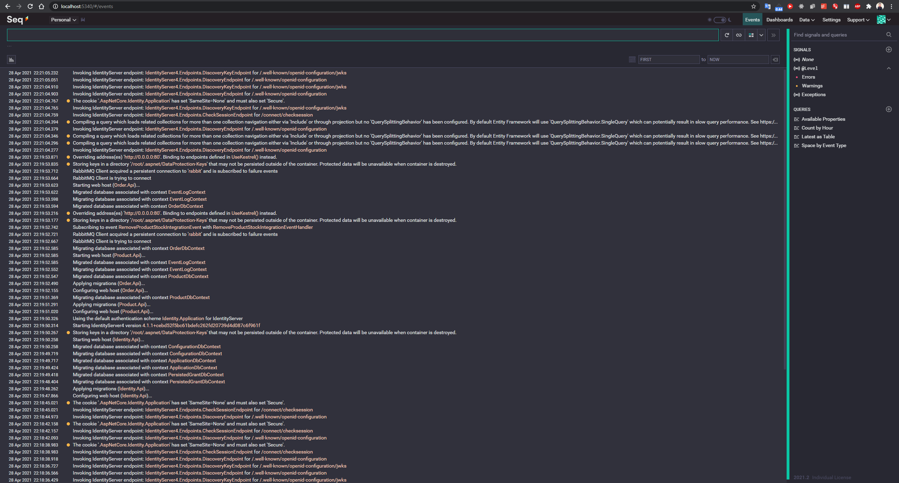
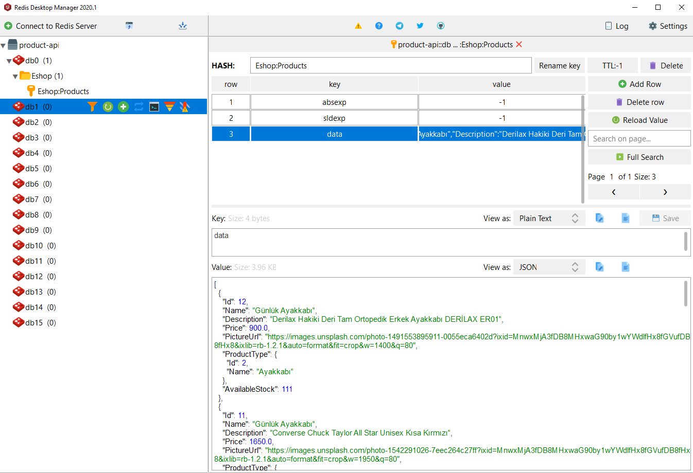

# .NET Microservices Sample Application

Sample .NET 5 reference application, based on a simplified microservices architecture and Docker containers.


## Getting Started

Make sure you have install and configured docker in your environment. After that, you can run the below commands from the **/** directory and get started with the `eShopZero` immediately.

```powershell
docker-compose up --build
```

You should be able to browse different components of the application by using the below URLs :

```
Web React : http://localhost:4000/
```
## Scenario

The user adds their products to the basket during shopping and creates an order. Order API broadcasts order creation message to RabbitMQ. Product Api consumes this event. The ordered product quantity reduces the current stock.

## Create Order Scenario


## Docker Containers

| Image   | Port  | Host   | 
|---|---|---|
|  eshopzero/client:latest  | 4000  | localhost  |
|  eshopzero/gateway:dev |  5200 | localhost  |
|  eshopzero/product-api:dev | 5203  | localhost  |
|  eshopzero/order-api:dev | 5202  | localhost  |
|  eshopzero/identity-api:dev | 5201  | localhost  |
|  rabbitmq:3-management-alpine | 15672  | localhost  |
|  datalust/seq:latest | 5340  | localhost  |
|  postgres:latest | 5432  | localhost  |
|  redis:alpine | 6379  | localhost  |
|  portainer | 9000  | localhost  |

## Architecture Overview

This reference application is cross-platform on the server and client side thanks to .NET 5 services that can run on Linux or Windows containers depending on your Docker host, as well as any browser for client web applications. Architecture, a microservice oriented architecture implementation that includes multiple autonomous microservices (each has its own data / database) and different approaches (simple CRUD and DDD / CQRS patterns) within each microservice using Http as the communication protocol between client applications recommends. Supports asynchronous communication for propagating data updates between microservices and integration events and multiple services based on an Event Bus (RabbitMQ below) and other features described here.


## Tech Stack

- .Net 5
- RabbitMQ
- Serilog & Seq 
- Redis
- Event Source
- CQRS && DDD
- MediaTR
- ReactJS
- İdentity Server
- Docker
- Ocelot
- PostgreSQL
- Entity Framework Core
- Ant Design
- Portainer

# Screenshots

## Portainer Container Management UI


## Healthcheck UI


## Order Api


## Product Api


## Gateway


## Identity Server


## RabbitMQ



## Seq



## Redis



## Client App

#### Home Page

<br/>
#### Order Page


<br/>

#### Basket Page


